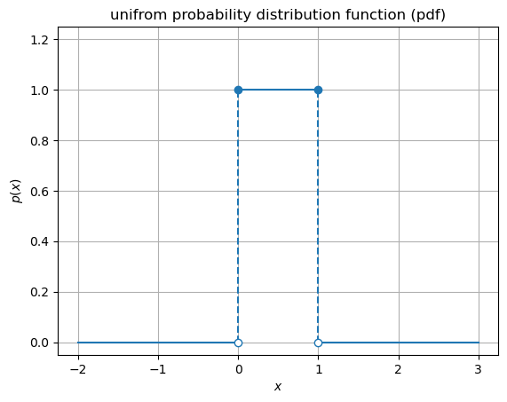
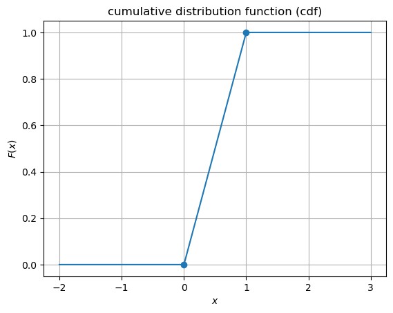
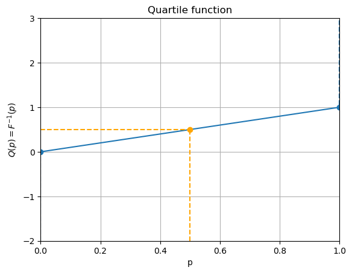

# ImgSampling

This project allows the user to upload an image and interprete them as 2D probability densities. One can then draw samples randomly from this probability density. To check if the algoritm is doing the correct thing, one can create a scatter plot of the randomly chosen samples painting them according to their probability. The result is an impressionistic probabilistic interpreation of the original image.

##### Table of Contents
- [Theory](#theory)
   * [The uniform distribution pdf and cdf](#the-uniform-distribution-pdf-and-cdf)
   * [Inverse CDF Sampling](#inverse-cdf-sampling)
   * [Rejection Sampling](#rejection-sampling)
   
 
  
 
## Theory

### The uniform distribution pdf and cdf
Before diving into the inner workings of the algorithm, let us quickly look at the mathematical theory behind it. 
The main question we want to adress is _how can we draw samples from a given probability distribution_? 

Let us start with an example.
A _uniform_ distribution is a probability distribution where each point inside a certain domain, say an interval $[a,b]$ is the same. 

For example, consider the throw of a dice. Each face $1,2,\dots,6$ has the same probability, namely $1/6$. 
Mathematically we can write this as follows: the throw of a dice is considered to be a _random variable_ $X$. It is a function on the sample space---the space of possible outcomes of throwing the dice---$S = \{1,2,\dots,6 \}$. For the experiment "throwing a dice", the likelihoods $P(X = s)$ (read: the probability of $X$ taking the value $s$) of throwing $s = 1,2,3,\dots$ is given by the assignment $P(X = s) = 1/6$ for _any_ outcome $s \in S$. Since the likelihoods are all the same, the probability _distribution_ $P(X)$ is called _uniform_. Note that $P(X = s)$ is just $1/|S|$ where $|S|$ stands for the number of elements in the set $S$ (here $|S| = 6$).

We could also think of a continous setting where the the dice could have a "face of any real number" inside an interval $[a,b] \subset (-\infty,\infty)$. This interval is again the sample space, i.e. the space of possible outcomes, of the experiment "X: throwing a dice".
In this case, it is more apropriate to think about the the probability _density_ function (PDF)

$$
\begin{align*} 
p(x) = \begin{cases} \frac{1}{b - a} \quad &\text{if~} x \in [a,b] \\\\ \\\\ 0 \quad &\text{otherwise} \end{cases} 
\end{align*}
$$

 

In the continous case, the probability of $X$ being smaller or equal to a certian given number $x$ is given by the cumulative distribution function (cdf) represented by the integral

$$ F_X(x) = P(X \leq x) = \int_{-\infty}^x p(x) dx $$

 

And due to the linear properties of the integral, we can compute the probability to throw a number $x$ such that $a < x < b$ simply by considering 

$$P(a < x < b) = F_X(b) - F_X(a) = \int_{-\infty}^b p(x)dx - \int_{-\infty}^a p(x)dx = \int_a^b p(x)dx$$

 The cdfs have to respect some natural conditions in order to allow an interpretation as probabilities:

 * domain: the cdf maps the real number line to the interval $[0,1]$: $F_X(x)\colon \mathbb{R} \to [0,1]$
   
 * positivity: for any $x$, $F_X(x) \geq 0$ (indeed it does not make a lot of sense to talk about negative probabilities)
   
 * normalisation: $\lim_{x\to \infty} F_X(x) = 1$ (certainly, if $F_X(x) = P(X \leq x)$ measures the probability that when we are thrwoing our infinite dice (whose faces can be any real number $x$) then certainly we will find some $x < \infty$) 

### Inverse CDF Sampling
For a uniform distribution, there is an interesting fact, which we will exploit in a minute.
Suppse that $U$ is a random variable that is uniformly distributed on $[0,1]$, that is its pdf is of the form 

$$
\begin{align*} 
p(u) = \begin{cases} 1 \quad &\text{if~} x \in [0,1] \\\\ \\\\ 0 \quad &\text{otherwise} \end{cases} 
\end{align*}
$$

How does its cdf look like? If one computes the integral, one finds a surprisingly simple form! Namely 

$$
\begin{align*} 
F_U(u) = \begin{cases} u \quad &\text{if~} u \in [0,1] \\\\ \\\\ 0 \quad &\text{otherwise} \end{cases} 
\end{align*}
$$

The cdf is just linear (see the picture above) inside the interval and zero everywhere else!

This linear relationship is what allows us to find the pdf starting from a known cdf! Let's pause and think about this for a minute. Suppose that we are given a cdf $F(x)$ (a function which simply satisfies the above conditions of having the correct domain, a correct normalisation and a correct limit as $x\to\infty$). A natural question to ask would be what is the associated pdf $p(x)$? We might be tempted to simply take the derivative and indeed if $F(x)$ is _nice enough_ that would be indeed true. However, there is another way to compute it. Suppose that $U$ is uniformally distributed. Then we claim that the random variable given by the inverse (in an appropriate sense) of $F$, $X = F^{-1}(U)$, is distributed according to the cdf $F(x)$. Let us start with this assumption and show that it is true. By the definition of a cdf, we have

$$P(X \leq x) = P( F^{-1}(U) \leq x) = P( U \leq F(x) )$$

But since $U$ is uniformly distributed, $P( U \leq F(x)) = F(x)$ and so we find 

$$P( X \leq x) = F(x)$$

which means that $F(x)$ is indeed the cdf of the random variable $X = F^{-1}(U)$.

But this is a neat result! In particular, because many programming languages have built in methods to randomly sample uniformally distributed numbers which now allow us to sample according to _any_ distribution we like! Here is the algorithm: suppose we want to draw numbers (or throw dices whose faces are) distributed according to some pdf $p(x)$. Then

1. find the cdf $F_X$
2. find its inverse $F_X^{-1}$
3. draw / throw a uniformly distributed random number $u$ using built in methods
4. the number $x = F_X^{-1}(u)$ is a random sample from the orighinal distribution $p(x)$!
 
**Remark** Actual randomness is hard to achieve and to the best of my knowledge still an open problem. This is why many sources (rightfully) speak of _pseudo_ random numbers when they are generated by the computer.

The question that remains is how to find the inverse $F^{-1}$ (also known as the _quartile function_ and often denoted $Q$) the cdf. 
If it is not analytically accessible (the usual case for real-world distributions), one way compute $Q(p) = F^{-1}(p)$ for a given "probability" $p$ (a uniform random variable between 0 and 1), we can simply search for the smallest $x$, such that $F(x) \leq p$. 

For the uniform distribution discussed above, this is particularly easy since the quartile function $Q = F^{-1}$  _coincides_ with the cdf itself! Of course, this is just an artifact of the simplicity of the uniform distribution for which $F(x) = x$ is linear with unit slope and hence $Q = F^{-1} = F$.

 

### Rejection Sampling

Another mehtod to sample from a known pdf is a two-step algorithm known as _rejection sampling_ (or _accept-reject sampling_). 
This algorithm has the advantage that it we do not need to know the cdf, let alone invert it (which in real-world applications if often times not feasible).

The algorithm goes as follows: Assume that we know an _unnormalised_ pdf $f(x)$. 
The actual probabilities are given by the _normalised_ pdf $p(x) = \frac{p(x)}{N}$ where $N$ is a normalisation constant (for simplicity, let us assume continuous distributions throught this exposition)

$$N = \int_{-\infty}^{\infty} f(x) dx$$

This integral is often times hard to compute and computational cost intensive (if possible at all).
Now, assume that $g(x)$ is a pdf which we know and from which we can easily draw samples, for example a uniform distribution or a normal distribution. And let $M$ be a positive real number such that for all values of $x$, 

$$ M g(x) > f(x)$$

Rejection sampling now proceeds in two steps 

1. propose a sample: we draw a sample $\hat x$ from $g(x)$ and propose it to be our sample from $f(x)$
2. accept or reject the sample: we accept the sample with probability $A = \frac{f(x)}{Mg(x)}$.

**Remark** Note that since $M g > f$ everywhere, $A \in [0,1]$ and can therefore indeed be interpreted as a probability.

But why does it work? Intuitively, let us think about the following corner case: assume $\hat x$ is very likely when drawn from the distribution $p(x)$ (or $f(x)$) but very rarely when drawn from $g(x)$. This means that we are quite unlikely to propose $\hat x$, but if we do, we should definitely accept the sample because it is very likely to appear in $p(x)$! This means that the acceptence probability for this case should be very high, which is indeed the case for $A = \frac{p(x)}{M g(x)}$. 
On the other hand, suppose it is very likely to draw $\hat x$ from $g(x)$ but highly unlikely to appear in $p(x)$. In this case, we would propose $\hat x$ many times, however we should almost always reject it. This means that the acceptence probability $A$ is supposed to be very small in this example, which is indeed the case.

Now, let us spell out why the acceptence probability $A$ recovers indeed samples from $p(x)$. 
To prove it, we use _Bayes' theorem_ which states that 

"Given a state $a$, the probability $P(b \mid a)$ of finding a state $b$ is the same as the probability $P(a \mid b) of finding the state $a$ given the state $b$ **and** finding the state $b$ at all, $P(b)$, divided by the probability $P(a)$ to find $a$"

In formulas

$$P(b \mid a) = \frac{P(a \mid b) P(b) }{P(a)} \implies P(b \mid a)P(a) = P(a \mid b)P(b)$$

In our case, by construction, the probability (density) of finding the proposed state $\hat x$ given that we accept it is 

$$P(\hat x \mid A) = \frac{P(A \mid \hat x) P(\hat x)}{P(A)} = \frac{\frac{f(\hat x)}{M\cdot g(\hat x)}\cdot g(\hat x)}{P(A)}$$

Now, the probability that we accept _any_ given sample is given by the integral of the probability of accepting a given sample and drawing the sample in the first place, that is

$$P(A) = \int \frac{f(x)}{M\cdot g(x)} \cdot g(x) dx = \frac{1}{M} \int f(x) dx = \frac{N}{M}$$

Substituting this yields that drawing a sample $\hat x$ under the condition that we accept it is given indeed by the pdf $p(x)$ we are trying to sample from!

$$P(\hat x \mid A) = \frac{\frac{f(\hat x)}{M\cdot g(\hat x)}\cdot g(\hat x)}{P(A)} = \frac{\frac{f(\hat x)}{M}}{\frac{N}{M}} = \frac{f(\hat x)}{N} = p(\hat x)$$

